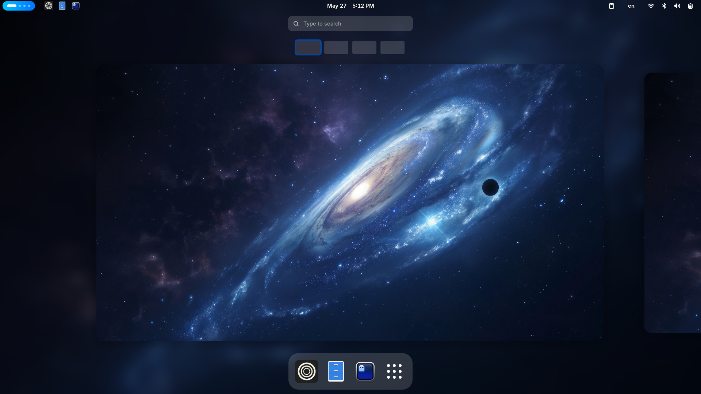

# Ansible Personal Configurations

This is my configurations for my Fedora 42 machine using Ansible to setup it up with ansible-pull command.



# What does it do?

- Installs packages I use from dnf, COPR, flatpak and cargo if needed.
- Enable and start dnf5 automatic updates.
- Uninstall applications installed by Fedora 42 that I don't use.
- Install GNOME extensions and apply GNOME settings using dconf.
- Copy over wallpaper and config files for programs I use (zsh, nvim, conky, etc...).
- Setup Zen Browser (extensions, settings and tabs).

In other words, it will change your system, so don't use it on your own machine.

# How to run it
Don't :)

or 

Use this:
```bash
ansible-pull -KU https://github.com/adnan-najjar/ansible_personal_config
```
